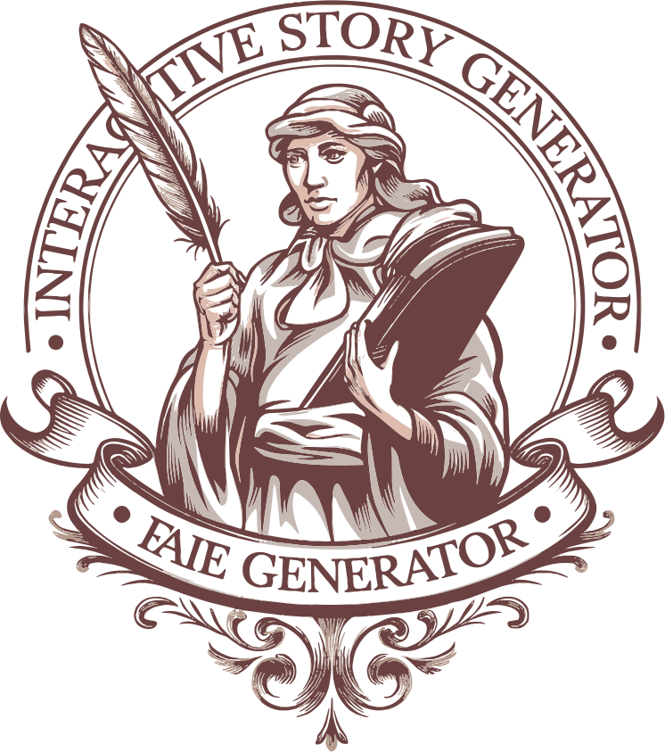

<div align="center"><a name="readme-top"></a>

[](#)

# 🎭 Interactive Story Generator<br/><h3>AI-Powered Collaborative Storytelling Platform</h3>

An innovative storytelling platform that leverages cutting-edge AI technology to create engaging, interactive narratives.<br/>
Supports multiple story genres, dynamic character creation, and real-time collaborative storytelling.<br/>
One-click **FREE** deployment of your personalized story generator.

[Live Demo][demo-site] · [Documentation][docs] · [Issues][github-issues-link] · [Contributing][contributing-guide]

<br/>

[][demo-site]

<br/>

<!-- SHIELD GROUP -->

[![][github-release-shield]][github-release-link]
[![][github-stars-shield]][github-stars-link]
[![][github-forks-shield]][github-forks-link]
[![][github-issues-shield]][github-issues-link]
[![][github-license-shield]][github-license-link]<br/>
[![][python-shield]][python-link]
[![][gradio-shield]][gradio-link]
[![][huggingface-shield]][huggingface-link]
[![][pytorch-shield]][pytorch-link]

**Share Interactive Story Generator**

[![][share-x-shield]][share-x-link]
[![][share-linkedin-shield]][share-linkedin-link]
[![][share-reddit-shield]][share-reddit-link]
[![][share-telegram-shield]][share-telegram-link]

<sup>🌟 Revolutionizing creative storytelling through AI collaboration. Built for writers, creators, and storytelling enthusiasts.</sup>

</div>

> [!IMPORTANT]
> This project demonstrates modern AI-powered storytelling with real-time generation, multiple genre support, and collaborative narrative development. It combines Gradio's intuitive interface with Hugging Face's powerful language models to provide an engaging storytelling experience.

<details>
<summary><kbd>📑 Table of Contents</kbd></summary>

#### TOC

- [🎭 Interactive Story GeneratorAI-Powered Collaborative Storytelling Platform](#-interactive-story-generatorai-powered-collaborative-storytelling-platform)
      - [TOC](#toc)
      - [](#)
  - [🌟 Introduction](#-introduction)
  - [✨ Key Features](#-key-features)
    - [`1` AI-Powered Story Generation](#1-ai-powered-story-generation)
    - [`2` Multi-Genre Support](#2-multi-genre-support)
    - [`3` Dynamic Character Creation](#3-dynamic-character-creation)
    - [`*` Additional Features](#-additional-features)
  - [🛠️ Tech Stack](#️-tech-stack)
  - [🏗️ Architecture](#️-architecture)
    - [System Architecture](#system-architecture)
    - [Data Flow](#data-flow)
  - [🚀 Getting Started](#-getting-started)
    - [Prerequisites](#prerequisites)
    - [Quick Installation](#quick-installation)
    - [Environment Setup](#environment-setup)
  - [🛳 Deployment](#-deployment)
    - [`A` Hugging Face Spaces](#a-hugging-face-spaces)
    - [`B` Local Deployment](#b-local-deployment)
    - [`C` Environment Variables](#c-environment-variables)
  - [📖 Usage Guide](#-usage-guide)
    - [Basic Usage](#basic-usage)
    - [Advanced Configuration](#advanced-configuration)
  - [🎨 Story Customization](#-story-customization)
  - [⌨️ Development](#️-development)
  - [🤝 Contributing](#-contributing)
  - [📄 License](#-license)
  - [👥 Author](#-author)

####

<br/>

</details>

## 📸 Project Screenshots

> [!TIP]
> Experience the intuitive interface and powerful features of our AI storytelling platform.

https://github.com/user-attachments/assets/4ab7053f-aeb4-4c70-800a-5c4b4e8285ba

<div align="center">
  
  <p><em>Main Interface - Story Creation and Character Settings</em></p>
</div>

<div align="center">
  
  <p><em>Advanced Configuration - Fine-tune AI Parameters</em></p>
</div>

## 🌟 Introduction

We are passionate about combining cutting-edge AI technology with creative storytelling. The Interactive Story Generator empowers users to create engaging narratives through intelligent AI collaboration, offering multiple genres, dynamic characters, and real-time story development.

Whether you're a creative writer, educator, or storytelling enthusiast, this platform provides an innovative playground for narrative exploration. The project is actively developed and welcomes community feedback for any [issues][github-issues-link] encountered.

> [!NOTE]
> - Python 3.8+ required
> - Hugging Face API token required for AI model access
> - Gradio for intuitive web interface
> - Real-time story generation capabilities

| [![][demo-shield-badge]][demo-site] | No installation required! Experience AI storytelling immediately. |
| :------------------------------------ | :--------------------------------------------------------------------------------------------- |
| [![][github-shield-badge]][github-stars-link] | Join our community! Star us to stay updated with new features and releases. |

> [!TIP]
> **⭐ Star us** to receive all release notifications and support the project's development!

<details>
  <summary><kbd>⭐ Star History</kbd></summary>
  <picture>
    <source media="(prefers-color-scheme: dark)" srcset="https://api.star-history.com/svg?repos=ChanMeng666%2Finteractive-story-generator&theme=dark&type=Date">
    
  </picture>
</details>

## ✨ Key Features

### `1` AI-Powered Story Generation

Experience next-generation storytelling with our advanced AI system powered by Hugging Face's Zephyr-7B-Beta model. The platform delivers coherent, engaging narratives that adapt to your creative input and maintain story continuity across multiple interactions.

Key capabilities include:
- 🤖 **Advanced AI Model**: Powered by HuggingFace Zephyr-7B-Beta
- 🔄 **Real-time Generation**: Streaming story development
- 🧠 **Context Awareness**: Maintains story coherence and character consistency
- 🎯 **Adaptive Storytelling**: Responds intelligently to user input

### `2` Multi-Genre Support

Choose from diverse story genres and themes to match your creative vision. Our platform supports comprehensive customization options for different storytelling styles.

**Available Genres:**
- 🏰 **Fantasy**: Magical worlds and mythical creatures
- 🚀 **Science Fiction**: Futuristic technology and space exploration
- 🔍 **Mystery**: Puzzles, investigations, and suspenseful plots
- 🗡️ **Adventure**: Thrilling journeys and heroic quests
- 💕 **Romance**: Emotional connections and relationship dynamics
- 👻 **Horror**: Supernatural elements and thrilling suspense

**Story Themes:**
- Adventure, Mystery, Romance, Historical, Slice of Life, Fairy Tale

### `3` Dynamic Character Creation

Build compelling characters using expert-designed templates or create custom personalities from scratch. Our character system helps develop rich personalities that drive your story forward.

**Character Templates:**
- 🗡️ **Adventurer**: Brave explorers who love challenges
- 🔍 **Detective**: Keen investigators with sharp observation skills
- 🎨 **Artist**: Creative individuals with unique perspectives
- 🔬 **Scientist**: Curious researchers dedicated to discovery
- 👤 **Ordinary Person**: Relatable characters with rich inner worlds

### `*` Additional Features

Beyond core storytelling, the platform includes:

- [x] 🎛️ **Advanced Controls**: Fine-tune creativity, coherence, and length
- [x] 💾 **Story Management**: Save and export your creative works
- [x] 🔄 **Real-time Interaction**: Continuous dialogue with AI
- [x] 📊 **Parameter Control**: Adjust temperature, max tokens, and sampling
- [x] 🎨 **Intuitive Interface**: User-friendly Gradio-based design
- [x] 📱 **Responsive Design**: Works seamlessly across devices
- [x] 🔧 **Customizable Settings**: Tailor the experience to your preferences
- [x] 📖 **Built-in Guidance**: Comprehensive usage instructions

> ✨ More features are continuously being added based on community feedback.

<div align="right">

[![][back-to-top]](#readme-top)

</div>

## 🛠️ Tech Stack

<div align="center">
  <table>
    <tr>
      <td align="center" width="96">
        
        <br>Python 3.8+
      </td>
      <td align="center" width="96">
        
        <br>Gradio 4.44
      </td>
      <td align="center" width="96">
        
        <br>HF Hub 0.25
      </td>
      <td align="center" width="96">
        
        <br>PyTorch 2.2
      </td>
      <td align="center" width="96">
        
        <br>Transformers
      </td>
    </tr>
  </table>
</div>

**Core Technologies:**
- **Language**: Python 3.8+ for robust backend processing
- **Interface**: Gradio 4.44.1 for intuitive web interface
- **AI Engine**: Hugging Face Hub 0.25.2 for model access
- **Deep Learning**: PyTorch 2.2.1 for neural network operations
- **NLP**: Transformers 4.38.2 for advanced language processing

**Key Libraries:**
- **Environment Management**: python-dotenv for configuration
- **Model Integration**: HuggingFace Zephyr-7B-Beta for story generation
- **Real-time Streaming**: Gradio's streaming capabilities
- **Error Handling**: Comprehensive logging and retry mechanisms

> [!TIP]
> Each technology was selected for production readiness, ease of use, and seamless integration with AI language models.

## 🏗️ Architecture

### System Architecture


### Data Flow


## 🚀 Getting Started

### Prerequisites

> [!IMPORTANT]
> Ensure you have the following installed:

- Python 3.8 or higher ([Download](https://python.org/downloads/))
- pip package manager
- Git ([Download](https://git-scm.com/))
- Hugging Face account and API token ([Get Token](https://huggingface.co/settings/tokens))

### Quick Installation

**1. Clone Repository**

```bash
git clone https://github.com/ChanMeng666/interactive-story-generator.git
cd interactive-story-generator
```

**2. Install Dependencies**

```bash
# Install required packages
pip install -r requirements.txt
```

**3. Environment Setup**

```bash
# Create environment file
touch .env

# Add your Hugging Face token
echo "HF_TOKEN=your_hugging_face_token_here" >> .env
```

**4. Run Application**

```bash
python app.py
```

🎉 **Success!** Open [http://localhost:7860](http://localhost:7860) to start creating stories.

### Environment Setup

Create a `.env` file with the following variables:

```bash
# Required: Hugging Face API Token
HF_TOKEN=your_hugging_face_token_here

# Optional: Custom model endpoint
MODEL_ENDPOINT=HuggingFaceH4/zephyr-7b-beta

# Optional: Application settings
APP_PORT=7860
APP_HOST=localhost
DEBUG_MODE=false
```

> [!TIP]
> Get your Hugging Face token from [https://huggingface.co/settings/tokens](https://huggingface.co/settings/tokens)

## 🛳 Deployment

### `A` Hugging Face Spaces

**One-Click Deployment:**

[](https://huggingface.co/spaces/ChanMeng666/interactive-story-generator)

**Manual Deployment:**

1. Create a new Space on Hugging Face
2. Upload your code files
3. Add your `HF_TOKEN` to Space secrets
4. Configure Space settings for Gradio app

### `B` Local Deployment

**Development Mode:**

```bash
# Run with auto-reload
python app.py

# Run with specific port
python app.py --port 7860
```

**Production Mode:**

```bash
# Install production dependencies
pip install gunicorn

# Run with Gunicorn
gunicorn app:demo.app --bind 0.0.0.0:7860
```

### `C` Environment Variables

| Variable | Description | Required | Default | Example |
|----------|-------------|----------|---------|---------|
| `HF_TOKEN` | Hugging Face API token | ✅ | - | `hf_xxxxxxxxxxxxx` |
| `MODEL_ENDPOINT` | AI model endpoint | 🔶 | `HuggingFaceH4/zephyr-7b-beta` | Custom model path |
| `APP_PORT` | Application port | 🔶 | `7860` | `8080` |
| `DEBUG_MODE` | Enable debug logging | 🔶 | `false` | `true` |

> [!NOTE]
> ✅ Required, 🔶 Optional

## 📖 Usage Guide

### Basic Usage

**Getting Started:**

1. **Choose Story Style** - Select from Fantasy, Sci-Fi, Mystery, Adventure, Romance, or Horror
2. **Pick Theme** - Choose Adventure, Mystery, Romance, Historical, Slice of Life, or Fairy Tale
3. **Create Character** - Use templates or custom descriptions
4. **Describe Scene** - Set the initial story environment
5. **Generate Story** - Click "✨ Start Story" to begin
6. **Continue Narrative** - Interact with AI to develop the plot

**Story Generation Process:**

```python
# Example story generation flow
story_params = {
    "style": "Fantasy",
    "theme": "Adventure", 
    "character": "A brave knight seeking ancient treasures",
    "scene": "A mysterious forest at dawn"
}

# AI generates opening based on parameters
# User provides input to continue story
# AI maintains context and continues narrative
```

### Advanced Configuration

**Parameter Controls:**

- **Temperature (0.1-2.0)**: Controls creativity vs coherence
  - Lower values (0.1-0.7): More focused, consistent output
  - Higher values (0.8-2.0): More creative, varied output

- **Max Tokens (64-1024)**: Controls response length
  - Lower values: Concise responses
  - Higher values: Detailed, elaborate responses

- **Top-p (0.1-1.0)**: Controls vocabulary diversity
  - Lower values: More predictable word choices
  - Higher values: More varied vocabulary

## 🎨 Story Customization

**Character Templates:**

```python
CHARACTER_TEMPLATES = {
    "Adventurer": "A brave and fearless explorer who loves adventure and challenges.",
    "Detective": "A keen and observant detective skilled in observation and deduction.",
    "Artist": "A creative artist with unique perspectives on beauty.",
    "Scientist": "A curious scientist dedicated to exploring the unknown.",
    "Ordinary Person": "An ordinary person with a rich inner world."
}
```

**Story Styles & Themes:**

- **Fantasy**: Magical realms, mythical creatures, epic quests
- **Science Fiction**: Future technology, space exploration, AI
- **Mystery**: Puzzles, investigations, hidden secrets
- **Adventure**: Thrilling journeys, heroic challenges
- **Romance**: Emotional connections, relationship dynamics
- **Horror**: Supernatural elements, suspenseful atmosphere

## ⌨️ Development

**Setup Development Environment:**

```bash
# Clone repository
git clone https://github.com/ChanMeng666/interactive-story-generator.git
cd interactive-story-generator

# Install development dependencies
pip install -r requirements.txt

# Run in development mode
python app.py
```

**Development Scripts:**

```bash
# Start development server
python app.py

# Run with debug mode
DEBUG_MODE=true python app.py

# Test story generation
python -c "from app import generate_story; print(list(generate_story('test scene', 'Fantasy', 'Adventure', 'test character')))"
```

**Project Structure:**

```
interactive-story-generator/
├── app.py                    # Main application file
├── requirements.txt          # Python dependencies
├── .env                     # Environment variables
├── stories/                 # Generated story files
├── public/                  # Static assets
│   └── interactive-story-generator-logo.svg
├── README.md               # Project documentation
├── LICENSE                 # Apache 2.0 License
└── CODE_OF_CONDUCT.md     # Community guidelines
```

## 🤝 Contributing

We welcome contributions! Here's how you can help improve the Interactive Story Generator:

**Ways to Contribute:**
- 🐛 **Bug Reports**: Help identify and fix issues
- 💡 **Feature Requests**: Suggest new capabilities
- 📚 **Documentation**: Improve guides and examples
- 🔧 **Code Contributions**: Submit pull requests
- 🎨 **UI/UX Improvements**: Enhance user experience

**Development Process:**

1. **Fork the Repository**
2. **Create Feature Branch**: `git checkout -b feature/amazing-feature`
3. **Make Changes**: Follow coding standards
4. **Add Tests**: Ensure functionality works
5. **Submit PR**: Include clear description

**Contribution Guidelines:**
- Follow Python PEP 8 style guidelines
- Add docstrings for new functions
- Include tests for new features
- Update documentation as needed

[![][pr-welcome-shield]][github-issues-link]

## 📄 License

This project is licensed under the Apache License 2.0 - see the [LICENSE](LICENSE) file for details.

**License Benefits:**
- ✅ Commercial use allowed
- ✅ Modification allowed
- ✅ Distribution allowed
- ✅ Private use allowed

## 👥 Author

<div align="center">
  <table>
    <tr>
      <td align="center">
        <a href="https://github.com/ChanMeng666">
          
          <br />
          <sub><b>Chan Meng</b></sub>
        </a>
        <br />
        <small>Creator & Lead Developer</small>
      </td>
    </tr>
  </table>
</div>

**Contact Information:**
-  GitHub: [ChanMeng666](https://github.com/ChanMeng666)
-  LinkedIn: [chanmeng666](https://www.linkedin.com/in/chanmeng666/)
-  Email: [chanmeng.dev@gmail.com](mailto:chanmeng.dev@gmail.com)
-  Portfolio: [chanmeng.live](https://2d-portfolio-eta.vercel.app/)

---

<div align="center">
<strong>🎭 Pioneering AI-Powered Storytelling 🌟</strong>
<br/>
<em>Empowering creativity through intelligent collaboration</em>
<br/><br/>

⭐ **Star us on GitHub** • 📖 **Read the Documentation** • 🐛 **Report Issues** • 💡 **Request Features** • 🤝 **Contribute**

<br/><br/>

**Made with ❤️ by [Chan Meng](https://github.com/ChanMeng666)**


</div>

---

<!-- LINK DEFINITIONS -->

[back-to-top]: https://img.shields.io/badge/-BACK_TO_TOP-151515?style=flat-square

<!-- Project Links -->
[demo-site]: https://huggingface.co/spaces/ChanMeng666/interactive-story-generator
[docs]: https://github.com/ChanMeng666/interactive-story-generator/blob/main/README.md
[contributing-guide]: https://github.com/ChanMeng666/interactive-story-generator/blob/main/CODE_OF_CONDUCT.md

<!-- GitHub Links -->
[github-issues-link]: https://github.com/ChanMeng666/interactive-story-generator/issues
[github-stars-link]: https://github.com/ChanMeng666/interactive-story-generator/stargazers
[github-forks-link]: https://github.com/ChanMeng666/interactive-story-generator/forks
[github-release-link]: https://github.com/ChanMeng666/interactive-story-generator/releases
[github-license-link]: https://github.com/ChanMeng666/interactive-story-generator/blob/main/LICENSE

<!-- Tech Stack Links -->
[python-link]: https://python.org
[gradio-link]: https://gradio.app
[huggingface-link]: https://huggingface.co
[pytorch-link]: https://pytorch.org

<!-- Shield Badges -->
[github-release-shield]: https://img.shields.io/github/v/release/ChanMeng666/interactive-story-generator?color=369eff&labelColor=black&logo=github&style=flat-square
[github-stars-shield]: https://img.shields.io/github/stars/ChanMeng666/interactive-story-generator?color=ffcb47&labelColor=black&style=flat-square
[github-forks-shield]: https://img.shields.io/github/forks/ChanMeng666/interactive-story-generator?color=8ae8ff&labelColor=black&style=flat-square
[github-issues-shield]: https://img.shields.io/github/issues/ChanMeng666/interactive-story-generator?color=ff80eb&labelColor=black&style=flat-square
[github-license-shield]: https://img.shields.io/badge/license-Apache%202.0-white?labelColor=black&style=flat-square

[python-shield]: https://img.shields.io/badge/python-%3E%3D3.8-blue?style=flat-square&logo=python&logoColor=white
[gradio-shield]: https://img.shields.io/badge/gradio-4.44.1-orange?style=flat-square&logo=gradio&logoColor=white
[huggingface-shield]: https://img.shields.io/badge/huggingface-0.25.2-yellow?style=flat-square&logo=huggingface&logoColor=white
[pytorch-shield]: https://img.shields.io/badge/pytorch-2.2.1-red?style=flat-square&logo=pytorch&logoColor=white

[pr-welcome-shield]: https://img.shields.io/badge/🤝_PRs_welcome-%E2%86%92-ffcb47?labelColor=black&style=for-the-badge

<!-- Badge Variants -->
[demo-shield-badge]: https://img.shields.io/badge/TRY%20DEMO-ONLINE-55b467?labelColor=black&logo=vercel&style=for-the-badge
[github-shield-badge]: https://img.shields.io/badge/STAR%20ON-GITHUB-181717?labelColor=black&logo=github&style=for-the-badge

<!-- Social Share Links -->
[share-x-link]: https://x.com/intent/tweet?hashtags=AI,storytelling,opensource&text=Check%20out%20this%20amazing%20AI%20story%20generator&url=https%3A%2F%2Fgithub.com%2FChanMeng666%2Finteractive-story-generator
[share-linkedin-link]: https://linkedin.com/sharing/share-offsite/?url=https://github.com/ChanMeng666/interactive-story-generator
[share-reddit-link]: https://www.reddit.com/submit?title=Interactive%20Story%20Generator%20-%20AI%20Powered%20Storytelling&url=https%3A%2F%2Fgithub.com%2FChanMeng666%2Finteractive-story-generator
[share-telegram-link]: https://t.me/share/url?text=Check%20out%20this%20AI%20story%20generator&url=https%3A%2F%2Fgithub.com%2FChanMeng666%2Finteractive-story-generator

[share-x-shield]: https://img.shields.io/badge/-share%20on%20x-black?labelColor=black&logo=x&logoColor=white&style=flat-square
[share-linkedin-shield]: https://img.shields.io/badge/-share%20on%20linkedin-black?labelColor=black&logo=linkedin&logoColor=white&style=flat-square
[share-reddit-shield]: https://img.shields.io/badge/-share%20on%20reddit-black?labelColor=black&logo=reddit&logoColor=white&style=flat-square
[share-telegram-shield]: https://img.shields.io/badge/-share%20on%20telegram-black?labelColor=black&logo=telegram&logoColor=white&style=flat-square
